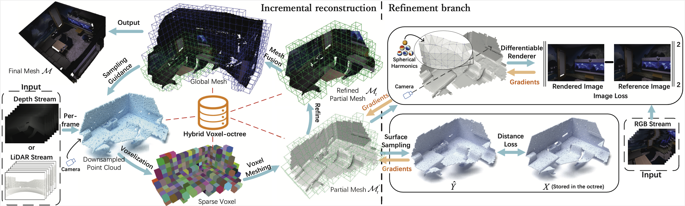

# HVOFusion: Incremental Mesh Reconstruction Using Hybrid Voxel Octree
The official repo for "[HVOFusion: Incremental Mesh Reconstruction Using Hybrid Voxel Octree](https://arxiv.org/abs/2404.17974)"


## Abstract

Incremental scene reconstruction is essential to the navigation in robotics. Most of the conventional methods typically make use of either TSDF (truncated signed distance functions) volume or neural networks to implicitly represent the surface. Due to the voxel representation or involving with timeconsuming sampling, they have difficulty in balancing speed, memory storage, and surface quality. In this paper, we propose a novel hybrid voxel-octree approach to effectively fuse octree with voxel structures so that we can take advantage of both implicit surface and explicit triangular mesh representation. Such sparse structure preserves triangular faces in the leaf nodes and produces partial meshes sequentially for incremental reconstruction. This storage scheme allows us to naturally optimize the mesh in explicit 3D space to achieve higher surface quality. We iteratively deform the mesh towards the target and recovers vertex colors by optimizing a shading model. Experimental results on several datasets show that our proposed approach is capable of quickly and accurately reconstructing a scene with realistic colors.

## The Main Architecture

<p align="center">

</p>

## Installation
To begin, create a virtual environment using Python 3.8 with PyTorch 1.10.1 and CUDA toolkit 11.3.

```bash
conda env create -f environment.yaml
```

Install `nvdiffrast`

```bash
git clone https://github.com/NVlabs/nvdiffrast
cd nvdiffrast
pip install .
```

Download the dataset from this [link](https://pan.baidu.com/s/1byeUjoqzJCfHEmUZMeNRoQ?pwd=bsjp) and unzip it into the "datasets" folder.

Compile third-party libraries in the "third_party" folder:

```bash
python setup.py install
```

Copy the path of the compiled `svo.cpython-xx-xxx.so` file into the torch.classes.load_library function in `main.py`:

```python
torch.classes.load_library("third_party/build/lib.linux-x86_64-3.8/svo.cpython-38-x86_64-linux-gnu.so")
```

## Run
Execute the following commands to run the code:

```bash
python main.py config/replica/office0.yaml
python main.py config/replica/office1.yaml
# ...
```

## Result
The results will be saved in the "out" folder.

## Citation

If you find this code useful for your research, please consider citing:
```
@inproceedings{liu2024hvo,
  title     = {HVOFusion: Incremental Mesh Reconstruction Using Hybrid Voxel Octree},
  author    = {Liu, Shaofan and Chen, Junbo and Zhu, Jianke},
  booktitle = {Proceedings of the Thirty-Third International Joint Conference on
               Artificial Intelligence, {IJCAI-24}},
  publisher = {International Joint Conferences on Artificial Intelligence Organization},
  pages     = {6850--6858},
  year      = {2024},
}

```

## Acknowledgements

This project is built on source codes shared by [Vox-Fusion](https://github.com/zju3dv/Vox-Fusion).